#模型

# AlexNet
### 一.网络框架
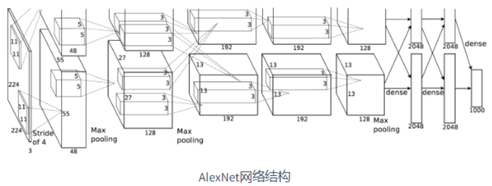
8个学习层：5个卷积层+3个全连接层（部分卷积层后有最大池化）

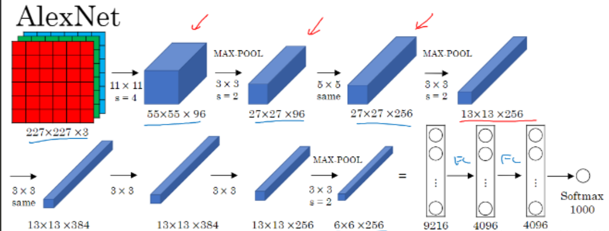

- 卷积后的矩阵尺寸大小计算公式： N = (W - F + 2P)/S +1
① 输入图片大小W x W
② Filter大小F x F 卷积核大小
③ stride步长S
④ padding的像素数P

#### 第一个卷积层

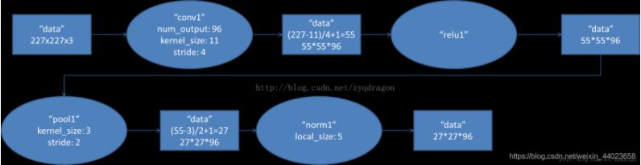
Conv1:  
kernels:48*2=96  
kernel_size:11  
paddding:[1,2]  
stride:4  
input_size:[224,224,3]  
output_size:[55,55,96]  
- Conv1 卷积运算 原始图像224 x 224 x 3(高，宽，深)  卷积核大小 11 * 11 ,卷积核个数48(两块GPU并行,所以48*2=96),stride步长4,（224-11+(1+2)）/4+1  
Maxpool1:  
kernel_size:3
paddinng:0
stride:2
input_size:[55,55,96]
output_size:[27,27,96]
- Maxpools 池化层计算 输入图像层 55 x 55 x 96 池化核大小 3 x 3,输出图像层(27 x 27 x 96)          （55-3）/2+1=27  
#### 第二个卷积层
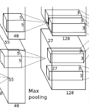
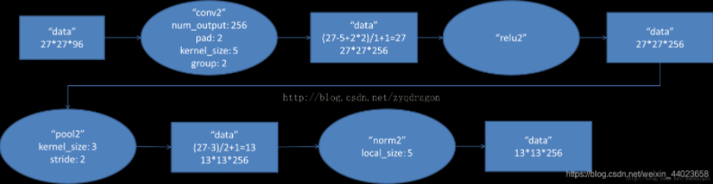
Conv2:  
kernels:128*2=256  
kernel_size:5  
stride:1  
paddding:[2,2]  
input_size:[27,27,96]  
output_size:[27,27,256]  
- Conv2 输入图像层大小27 x 27 x 96 卷积核大小 5 x 5,卷积核个数128,步长1,(27-5+2+2)/1+1=27  
Maxpool2:  
kernel_size:3
paddinng:0
stride:2
input_size:[27,27,256]
output_size:[13,13,256]
- Maxpool2 池化层计算 输入图像层 27 x 27 x 256 池化核大小 3 x 3,输出图像层(13 x 13 x 256)          （27-3）/2+1=13  
#### 第三个卷积层
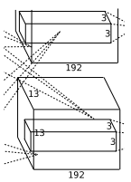
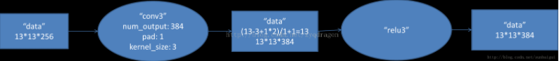
Conv3:  
kernels:192*2=384  
kernel_size:3  
stride:1  
paddding:[1,1]  
input_size:[13,13,256]  
output_size:[13,13,384]  
- Conv3 输入图像层大小 13 x 13 x 256 卷积核大小 3 x 3,卷积核个数384,步长1,(13-3+1+1)/1+1=13  
#### 第四个卷积层
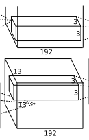
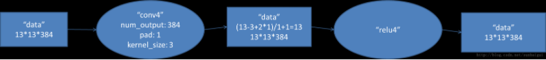
Conv4:  
kernels:192*2=384  
kernel_size:3  
stride:1  
paddding:[1,1]  
input_size:[13,13,384]  
output_size:[13,13,384]  
- Conv4 输入图像层大小 13 x 13 x 384 卷积核大小 3 x 3,卷积核个数384,步长1,(13-3+1+1)/1+1=13  
#### 第五个卷积层
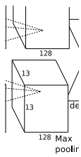
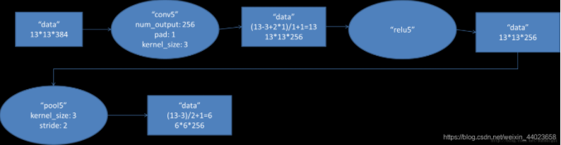
Conv5:  
kernels:128*2=256 
kernel_size:3  
stride:1  
paddding:[1,1]  
input_size:[13,13,384]  
output_size:[13,13,256]
- Conv5 输入图像层大小 13 x 13 x 384 卷积核大小 3 x 3,卷积核个数256,步长1,(13-3+1+1)/1+1=13  
Maxpool3:  
kernel_size:3
paddinng:0
stride:2
input_size:[13,13,256]
output_size:[13,13,256]  
- Maxpool3 输入图像层 13 x 13 x 256 池化核大小 3 x 3,输出图像层(6 x 6 x 256)          （13-3）/2+1=6

 # VGGNet

## 一、VGG的特点

#### 1、结构简洁

​	VGG由5层卷积层、3层全连接层、softmax输出层构成，曾与曾之间使用maxpooling(最大池化层)分开，所有隐藏单元都采用ReLU函数。

​	下图是来自论文《Very Deep Convolutional Networks for Large-Scale Image Recognition》（基于甚深层卷积网络的大规模图像识别）的VGG网络结构，正是在这篇论文中提出了VGG，如下图： 

在这篇论文中分别使用了A、A-LRN、B、C、D、E这6种网络结构进行测试，这6种网络结构相似，都是由5层卷积层、3层全连接层组成，其中区别在于每个卷积层的子层数量不同，从A至E依次增加（子层数量从1到4），总的网络深度从11层到19层

以网络结构D（VGG16）为例:

1、输入224x224x3的图片，经64个3x3的卷积核作两次卷积+ReLU，卷积后的尺寸变为224x224x64

2、作max pooling（最大化池化），池化单元尺寸为2x2（效果为图像尺寸减半），池化后的尺寸变为112x112x64

3、经128个3x3的卷积核作两次卷积+ReLU，尺寸变为112x112x128

4、作2x2的max pooling池化，尺寸变为56x56x128

5、经256个3x3的卷积核作三次卷积+ReLU，尺寸变为56x56x256

6、作2x2的max pooling池化，尺寸变为28x28x256

7、经512个3x3的卷积核作三次卷积+ReLU，尺寸变为28x28x512

8、作2x2的max pooling池化，尺寸变为14x14x512

9、经512个3x3的卷积核作三次卷积+ReLU，尺寸变为14x14x512

10、作2x2的max pooling池化，尺寸变为7x7x512

11、与两层1x1x4096，一层1x1x1000进行全连接+ReLU（共三层）

12、通过softmax输出1000个预测结果

#### 2、小卷积核和多卷积子层

​	VGG使用多个较小卷积核（3x3）的卷积层代替一个卷积核较大的卷积层，一方面可以减少参数，另一方面相当于进行了更多的非线性映射，可以增加网络的拟合/表达能力。

​	小卷积核是VGG的一个重要特点，虽然VGG是在模仿AlexNet的网络结构，但没有采用AlexNet中比较大的卷积核尺寸（如7x7），而是通过降低卷积核的大小（3x3），增加卷积子层数来达到同样的性能（VGG：从1到4卷积子层，AlexNet：1子层）。

​	VGG的作者认为两个3x3的卷积堆叠获得的感受野大小，相当一个5x5的卷积；而3个3x3卷积的堆叠获取到的感受野相当于一个7x7的卷积。这样可以增加非线性映射，也能很好地减少参数（例如7x7的参数为49个，而3个3x3的参数为27）

​	**使用更小的卷积核是当前在保证网络精度的情况下，减少参数的趋势之一，在VGG16中，使用了3个3\*3卷积核来代替7\*7卷积核，使用了2个3\*3卷积核来代替5\*5卷积核，这样做的主要目的是在保证具有相同感知野的条件下，提升了网络的深度，在一定程度上提升了神经网络的效果。**

##### 1、感受野

###### 	1.什么是感受野？

​		**感受野是指一个神经元能看到的输入区域**，给一个直观的例子：**这是3个3×3卷积核对于7× 7 卷积的代替演示图**

###### 		2.感受野的计算公式

###### 		**F(i) = (F(i+1)-1) x Stride + Ksize**

​		F(i) 为第i层感受野, Stride为第i层步距, Ksize为卷积核大小或者池化核大小

​	

感受野计算是从最后一层往前推，看能在原图上“看”到多大范围。
Feature map: F=1
Conv3x3(3): F=(1-1)/1+3=3
Conv3x3(2): F=(3-1)/1+3=5
Conv3x3(1): F=(5-1)/1+3=7
Conv7x7(1): F=(1-1)/1+7=7
由此可知用3x3卷积核叠3层后与7x7卷积核感受野相同。

# GoogLeNet

## 要点

1.引入Inception结构

2.使用1x1的卷积核进行降维以及映射处理

3.添加两个辅助分类器帮助训练

4.丢弃全连接层，使用平均池化层（大大减少模型参数）

## 什么是GoogLeNet

一般来说，提升网络性能最直接的办法就是增加网络深度和宽度，深度指网络层次数量、宽度指神经元数量。但这种方式存在以下问题：

（1）参数太多，如果训练数据集有限，很容易产生过拟合；

（2）网络越大、参数越多，计算复杂度越大，难以应用；

（3）网络越深，容易出现梯度弥散问题（梯度越往后穿越容易消失），难以优化模型。

那么，GoogLeNet是如何进一步提升性能的呢？有没有一种方法既能保持网络结构的稀疏性，又能利用密集矩阵的高计算性能。大量的文献表明可以将稀疏矩阵聚类为较为密集的子矩阵来提高计算性能，就如人类的大脑是可以看做是神经元的重复堆积，因此，GoogLeNet团队提出了Inception网络结构，就是构造一种“基础神经元”结构，来搭建一个稀疏性、高计算性能的网络结构。

## 什么是Inception

Inception历经了V1、V2、V3、V4等多个版本的发展，不断趋于完善，下面简单进行初始版和v1版本

## 一、Inception V1

通过设计一个稀疏网络结构，但是能够产生稠密的数据，既能增加神经网络表现，又能保证计算资源的使用效率。谷歌提出了最原始Inception的基本结构：

该结构将CNN中常用的卷积（1x1，3x3，5x5）、池化操作（3x3）堆叠在一起（卷积、池化后的尺寸相同，将通道相加），一方面增加了网络的宽度，另一方面也增加了网络对尺度的适应性。

网络卷积层中的网络能够提取输入的每一个细节信息，同时5x5的滤波器也能够覆盖大部分接受层的的输入。还可以进行一个池化操作，以减少空间大小，降低过度拟合。在这些层之上，在每一个卷积层后都要做一个**ReLU**操作，以增加网络的非线性特征。

然而这个Inception原始版本，所有的卷积核都在上一层的所有输出上来做，而那个5x5的卷积核所需的计算量就太大了，造成了特征图的厚度很大，为了避免这种情况，在3x3前、5x5前、max pooling后分别加上了1x1的卷积核，以起到了降低特征图厚度的作用，这也就形成了Inception v1的网络结构，如下图所示： 

**1x1的卷积核有什么用呢？**

1x1卷积的主要目的是为了减少维度，还用于修正线性激活（ReLU）。比如，上一层的输出为100x100x128，经过具有256个通道的5x5卷积层之后(stride=1，pad=2)，输出数据为100x100x256，其中，卷积层的参数为128x5x5x256= 819200。而假如上一层输出先经过具有32个通道的1x1卷积层，再经过具有256个输出的5x5卷积层，那么输出数据仍为为100x100x256，但卷积参数量已经减少为128x1x1x32 + 32x5x5x256= 204800，大约减少了4倍。

## GoogLeNet的结构

GoogLeNet的网络结构图细节如下： 

**0、输入**

原始输入图像为224x224x3，且都进行了零均值化的预处理操作（图像每个像素减去均值）。

**1、第一层（卷积层）**

使用7x7的卷积核（滑动步长2，padding为3），64通道，输出为112x112x64，卷积后进行ReLU操作

经过3x3的max pooling（步长为2），输出为((112 - 3+1)/2)+1=56，即56x56x64，再进行ReLU操作

**2、第二层（卷积层）**

使用3x3的卷积核（滑动步长为1，padding为1），192通道，输出为56x56x192，卷积后进行ReLU操作

经过3x3的max pooling（步长为2），输出为((56 - 3+1)/2)+1=28，即28x28x192，再进行ReLU操作

**3a、第三层（Inception 3a层）**

分为四个分支，采用不同尺度的卷积核来进行处理

（1）64个1x1的卷积核，然后RuLU，输出28x28x64

（2）96个1x1的卷积核，作为3x3卷积核之前的降维，变成28x28x96，然后进行ReLU计算，再进行128个3x3的卷积（padding为1），输出28x28x128

（3）16个1x1的卷积核，作为5x5卷积核之前的降维，变成28x28x16，进行ReLU计算后，再进行32个5x5的卷积（padding为2），输出28x28x32

（4）pool层，使用3x3的核（padding为1），输出28x28x192，然后进行32个1x1的卷积，输出28x28x32。

将四个结果进行连接，对这四部分输出结果的第三维并联，即64+128+32+32=256，最终输出28x28x256

**3b、第三层（Inception 3b层）**

（1）128个1x1的卷积核，然后RuLU，输出28x28x128

（2）128个1x1的卷积核，作为3x3卷积核之前的降维，变成28x28x128，进行ReLU，再进行192个3x3的卷积（padding为1），输出28x28x192

（3）32个1x1的卷积核，作为5x5卷积核之前的降维，变成28x28x32，进行ReLU计算后，再进行96个5x5的卷积（padding为2），输出28x28x96

（4）pool层，使用3x3的核（padding为1），输出28x28x256，然后进行64个1x1的卷积，输出28x28x64。

将四个结果进行连接，对这四部分输出结果的第三维并联，即128+192+96+64=480，最终输出输出为28x28x480

第四层（4a,4b,4c,4d,4e）、第五层（5a,5b）……，与3a、3b类似，在此就不再重复。
