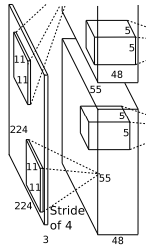

#模型

# AlexNet
### 一.网络框架

8个学习层：5个卷积层+3个全连接层（部分卷积层后有最大池化）

- 卷积后的矩阵尺寸大小计算公式： N = (W - F + 2P)/S +1
① 输入图片大小W x W
② Filter大小F x F 卷积核大小
③ stride步长S
④ padding的像素数P

#### 第一个卷积层

Conv1:  
kernels:48*2=96  
kernel_size:11  
paddding:[1,2]  
stride:4  
input_size:[224,224,3]  
output_size:[55,55,96]  
- Conv1 卷积运算 原始图像224 x 224 x 3(高，宽，深)  卷积核大小 11 * 11 ,卷积核个数48(两块GPU并行,所以48*2=96),stride步长4,（224-11+(1+2)）/4+1  
Maxpool1:  
kernel_size:3
paddinng:0
stride:2
input_size:[55,55,96]
output_size:[27,27,96]
- Maxpools 池化层计算 输入图像层 55 x 55 x 96 池化核大小 3 x 3,输出图像层(27 x 27 x 96)          （55-3）/2+1=27  
#### 第二个卷积层

Conv2:  
kernels:128*2=256  
kernel_size:5  
stride:1  
paddding:[2,2]  
input_size:[27,27,96]  
output_size:[27,27,256]  
- Conv2 输入图像层大小27 x 27 x 96 卷积核大小 5 x 5,卷积核个数128,步长1,(27-5+2+2)/1+1=27  
Maxpool2:  
kernel_size:3
paddinng:0
stride:2
input_size:[27,27,256]
output_size:[13,13,256]
- Maxpool2 池化层计算 输入图像层 27 x 27 x 256 池化核大小 3 x 3,输出图像层(13 x 13 x 256)          （27-3）/2+1=13  
#### 第三个卷积层

Conv3:  
kernels:192*2=384  
kernel_size:3  
stride:1  
paddding:[1,1]  
input_size:[13,13,256]  
output_size:[13,13,384]  
- Conv3 输入图像层大小 13 x 13 x 256 卷积核大小 3 x 3,卷积核个数384,步长1,(13-3+1+1)/1+1=13  
#### 第四个卷积层

Conv4:  
kernels:192*2=384  
kernel_size:3  
stride:1  
paddding:[1,1]  
input_size:[13,13,384]  
output_size:[13,13,384]  
- Conv4 输入图像层大小 13 x 13 x 384 卷积核大小 3 x 3,卷积核个数384,步长1,(13-3+1+1)/1+1=13  
#### 第五个卷积层

Conv5:  
kernels:128*2=256 
kernel_size:3  
stride:1  
paddding:[1,1]  
input_size:[13,13,384]  
output_size:[13,13,256]
- Conv5 输入图像层大小 13 x 13 x 384 卷积核大小 3 x 3,卷积核个数256,步长1,(13-3+1+1)/1+1=13  
Maxpool3:  
kernel_size:3
paddinng:0
stride:2
input_size:[13,13,256]
output_size:[13,13,256]  
- Maxpool3 输入图像层 13 x 13 x 256 池化核大小 3 x 3,输出图像层(6 x 6 x 256)          （13-3）/2+1=6

 

